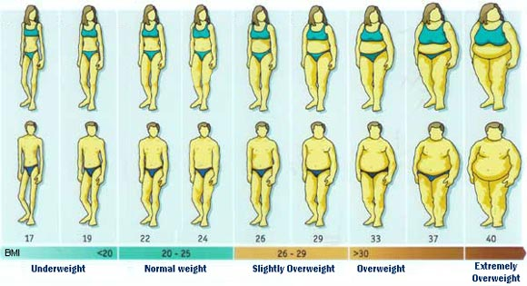

Apps Pitch Presentation - Calculate Your Body Mass Index (BMI)
========================================================
author: Fairul Shah Rizat
date:  31 January 2016

Purposed
========================================================
Body mass index (BMI) is a measure of body fat based on height and weight that applies to adult men and women.

How to Use.
- Step 1 : Open Apps at [CalculateBMI](https://fairulshahrizat.shinyapps.io/CalculateBMI/).
- Step 2 : Enter your weight, in Kilograms.
- Step 3 : Enter your height, in Cm.

Ui.R With Code
========================================================

OPen code UI.R at [UI.R Code](https://github.com/fairulshahrizat/Developing-Data-Products-Project/blob/master/ui.R). 

Server.R With Code
========================================================

OPen code Server.R at [Server.R Code](https://github.com/fairulshahrizat/Developing-Data-Products-Project/blob/master/server.R). 

Reference
========================================================

